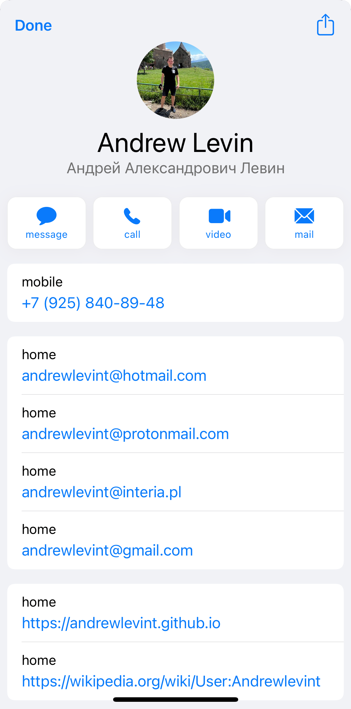

# Visiting Card ru - Andrew Levin

You can download and add my vCard with my contacts information to your Contact App by clicking an image or a button below

<a style="
color: #fff;
background-color: #007bff;
border-color: #007bff;
display: inline-block;
font-weight: 400;
text-align: center;
white-space: nowrap;
vertical-align: middle;
-webkit-user-select: none;
-moz-user-select: none;
-ms-user-select: none;
user-select: none;
border: 1px solid transparent;
padding: 0.375rem 0.75rem;
font-size: 1rem;
line-height: 1.5;
border-radius: 0.25rem;
transition: color .15s ease-in-out,background-color .15s ease-in-out,border-color .15s ease-in-out,box-shadow .15s ease-in-out;
"
href="https://raw.githubusercontent.com/andrewlevint/andrewlevint.github.io/mymain/vcard/ru/Levin_Andrew_ru.vcf"
role="button">
Download vCard</a>

<a
href="https://raw.githubusercontent.com/andrewlevint/andrewlevint.github.io/mymain/vcard/ru/Levin_Andrew_ru.vcf"
role="button">
https://raw.githubusercontent.com/andrewlevint/andrewlevint.github.io/mymain/vcard/ru/Levin_Andrew_ru.vcf
</a>

